# Praktikum-9

# Penjelasan Exception Handling
Exception (Eksepsi) : Merupakan suatu kesalahan (error) yang terjadi saat proses eksekusi program sedang berjalan, Kesalahan ini akan menyebabkan program berakhir dengan tidak normal. Kesalahan-kesalahan ini dapat diidentifikasikan dengan nama tertentu dan direpresentasikan sebagai objek di dalam python.

# Blok Try and Except :

- Setiap kode program yang memungkinkan terjadinya eksepsi, maka perlu untuk di tempatkan di dalam blok try.
- Ketika ada kesalahan maka kode di blok except akan dieksekusi.
- Sebaliknya jika program tidak memiliki kesalahan maka blok except akan di abaikan.

```python
try:
    # kode
except TipeEksepsi:
    # Penanganan kesalahan
```

- Handling : Penanganan file adalah bagian penting dari aplikasi apa pun. Python memiliki beberapa fungsi untuk membuat, membaca, memperbarui, dan menghapus file.

- Assertion (Pernyataan) : kewajaran program yang kamu bisa aktif/nonaktifkan ketika kamu selesai menjalankan program.

# The Assert Statement

- Saat menemukan pernyataan, Python mengevaluasi ekspresi yang menyertainya, yang mana semoga benar. Jika ekspresi salah, Python memunculkan pengecualian AssertionError.

# Contoh-contoh :

- Berikut adalah fungsi-fungsi yang mengubah suhu dari derajat Kelvin menjadi derajat Fahrenheit. Karena nol derajat Kelvin dingin, fungsi fungsi menyimpannya jika melihat negatif suhu.

- Ketika kode di bawah dijalankan, menghasilkan hasil sebagai berikut:

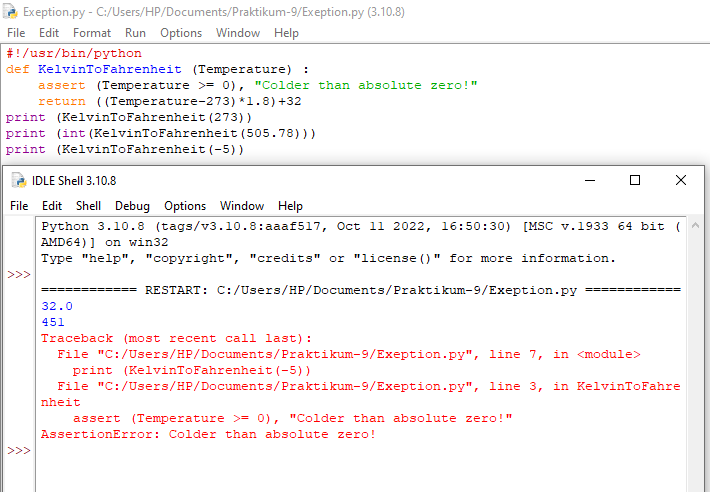

- Contoh-contoh ini membuka file, menulis konten file, dan keluar dengan aman karena ada tidak masalah.

- Ketika kode di bawah dijalankan, menghasilkan hasil sebagai berikut:

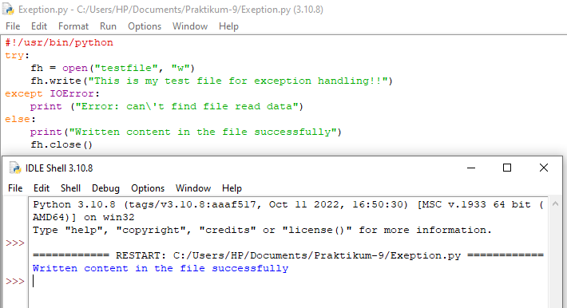

- Contoh ini mencoba membuka file yang Anda tidak memiliki izin menulis, sehingga membuat file pengecualian.

- Ketika kode di bawah dijalankan, menghasilkan hasil sebagai berikut:

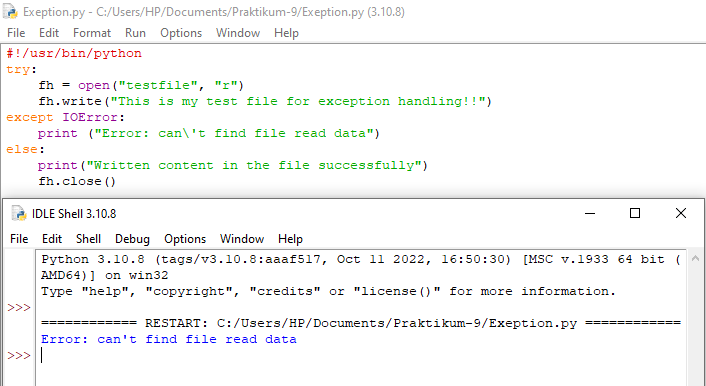

- Klausa kecuali dengan Berbagai Pengecualian.

- Jika Anda tidak memiliki izin untuk membuka file dalam mode tulis yang dapat ditulis, maka ini akan menghasilkan hasil berikut:

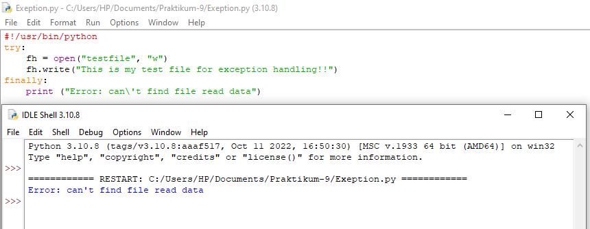

- Contoh yang sama dapat ditulis lebih bersih sebagai berikut:

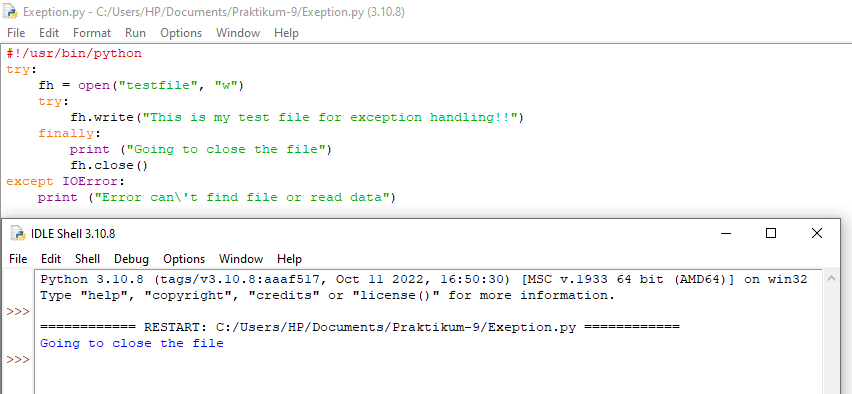

# Argumen Pengecualian.

- Ketika kode di bawah dijalankan, menghasilkan hasil sebagai berikut:

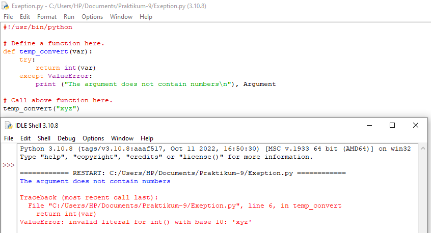

- Pengecualian dapat berupa string, kelas, atau objek. Sebagian besar pengecualian adalah pengecualian dari inti Python menimbulkan adalah kelas dengan argumen=argumen yang merupakan turunan dari kelas.

- Mendefinisikan pengecualian baru cukup mudah dan dapat dilakukan sebagai berikut:

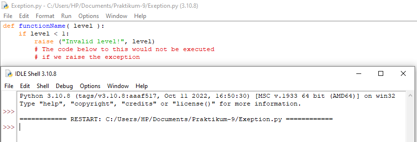

- Berikut adalah contoh-contoh yang terkait dengan RuntimeError. Di sini, kelas dibuat yang merupakan subkelas dari subkelas RuntimeError. Ini berguna saat anda perlu menampilkan tampilan informasi yang lebih spesifik saat e pengecualian tertangkap.

- Di blok try, pengecualian yang ditentukan pengguna dimunculkan dan ditangkap di blok except. Itu variabel e digunakan untuk membuat instance dari kelas Networkerror.

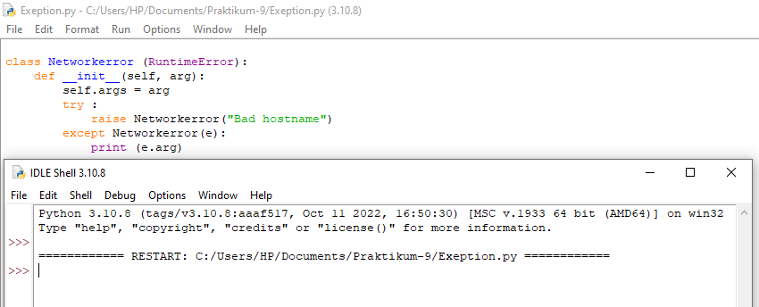

# Latihan

- Implementasikan penggunaan eksepsi pada lab-lab sebelumnya untuk mengatasi error yang ditimbulkan.

- Disini saya menggunakan program pada lab sebelumnya, yaitu program daftar nilai mahasiswa. Yang terdiri dari beberapa fungsi seperti tambah data, ubah data, hapus data dan Tampilkan data.

1. Menambah Data

- Fungsi def tambah() berfungsi untuk menginput variable nama, nim, nilai tugas, nilai uts dan nilai uas.
Apabila data yang diinputkan salah, maka kode except akan dijalankan.

```python
def tambah():
    print()
    print("Tambah Data")
    try :
        nama  = input    ("Nama        : ")
        nim   = int(input("NIM         : "))
        tugas = int(input("Nilai Tugas : "))
        uts   = int(input("Nilai UTS   : "))
        uas   = int(input("Nilai UAS   : "))
        nilaiakhir = ((tugas) * 30 / 100 + (uts) * 35 / 100 + (uas) * 35 / 100)
        data[nama] = [nim, tugas, uts, uas, nilaiakhir]

    except ValueError:
        print("Data yang dimasukkan salah! Ulangi lagi!")
        print()
```
# Output Tambah Data

- Output yang benar

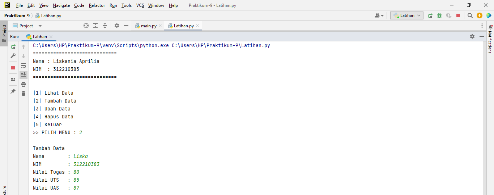

- Output yang salah 

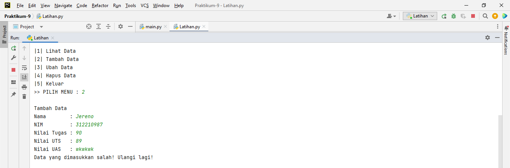

2. Mengubah Data

- Fungsi def ubah() berfungsi untuk mengubah data berdasarkan nama.

- Apabila data yang diinputkan salah, maka kode except akan dijalankan.

```python
def ubah():
    print()
    print("Ubah Data Mahasiswa")
    try :
        nama = input("Nama        : ")
        if nama in data.keys():
            nim   = int(input("NIM         : "))
            tugas = int(input("Nilai Tugas : "))
            uts   = int(input("Nilai UTS   : "))
            uas   = int(input("Nilai UAS   : "))
            nilaiakhir = ((tugas) * 30 / 100 + (uts) * 35 / 100 + (uas) * 35 / 100)
            data[nama] = [nim, tugas, uts, uas, nilaiakhir]


    except ValueError:
        print("Data harus berupa angka!")
        print()
```

# Output Ubah Data

- Output yang benar

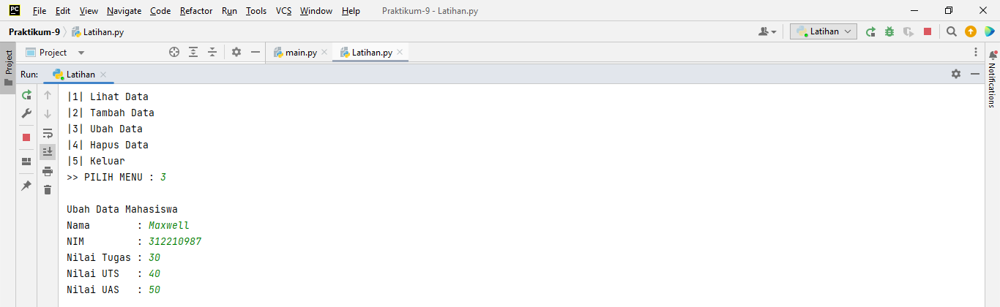

- Output yang salah 

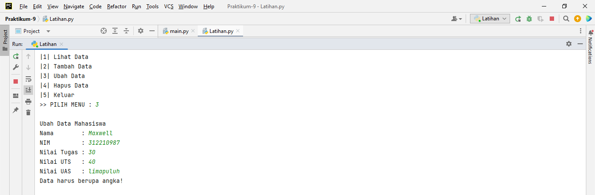

3. Menghapus Data

- Fungsi def hapus() berfungsi untuk menghapus data berdasarkan nama, jika data tidak ada maka akan ditampilkan "Data Tidak Ada".

```python
def hapus():
    print()
    print("Hapus Data Mahasiswa")
    nama  = input    ("Nama       : ")
    if nama in data.keys():
        del data[nama]
    else:
        print("Data {0} tidak ada".format(nama))
```
# Output Hapus Data

- Output yang benar

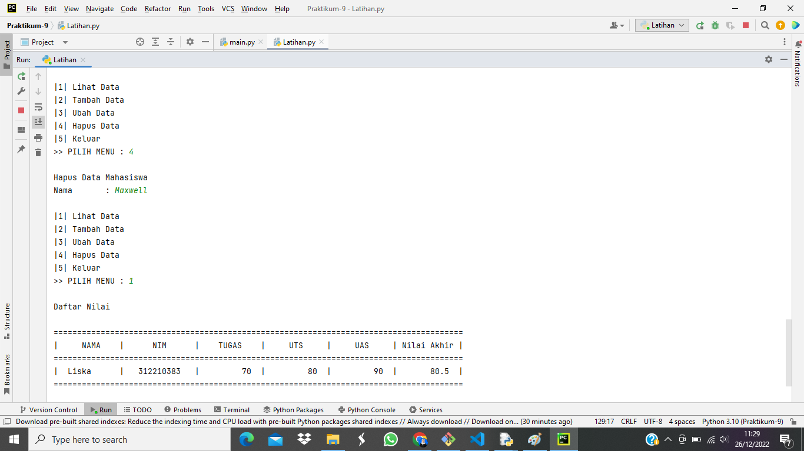

4. Menampilkan Data

- Fungsi def tampilkan() berfungsi untuk melihat data, jika data tidak ada maka akan ditampilkan tabel dengan tulisan "Tidak Ada Data".

```python
def tampilkan():
    if data.items():
        print()
        print("Daftar Nilai")
        print()
        print("=======================================================================================");
        print("|     NAMA    |      NIM      |    TUGAS    |     UTS     |     UAS     | Nilai Akhir |");
        print("=======================================================================================");
        i = 0
        for x in data.items():
            i+=i
            print("|  {0:9}  |   {1:9}   |  {2:9}  |  {3:9}  |  {4:9}  |  {5:9}  |"
                  .format(x[0][: 14], x[1][0], x[1][1], x[1][2], x[1][3], x[1][4], i))
            print("=======================================================================================");

    else :
        print()
        print("Daftar Nilai")
        print()
        print("======================================================================================");
        print("|    NAMA    |      NIM      |    TUGAS    |     UTS     |     UAS     | Nilai Akhir |");
        print("======================================================================================");
        print("|                                  TIDAK ADA DATA                                    |");
        print("======================================================================================");
    return
```
- Output yang benar

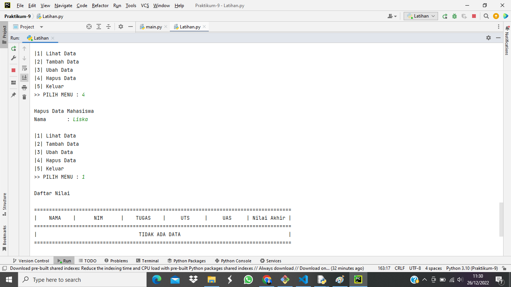

5. Pilih Menu

- Menggunakan perulangan while dengan nilai true dan menggunakan statement try dan except.

- Apabila yang diinputkan salah maka akan diminta untuk input ulang.

```python
while True:
    print()
    print("|1| Lihat Data")
    print("|2| Tambah Data")
    print("|3| Ubah Data")
    print("|4| Hapus Data")
    print("|5| Keluar")
    try :
        x = int(input(">> PILIH MENU : "))

        if x == 1:
            tampilkan()
        elif x == 2:
            tambah()
        elif x == 3:
            ubah()
        elif x == 4:
            hapus()
        elif x == 5:
            print("Program Selesai")
            print()
            loop = False

    except ValueError:
        print()
        print("Tidak ada menu! Ulangi lagi!")
```

- Output yang benar

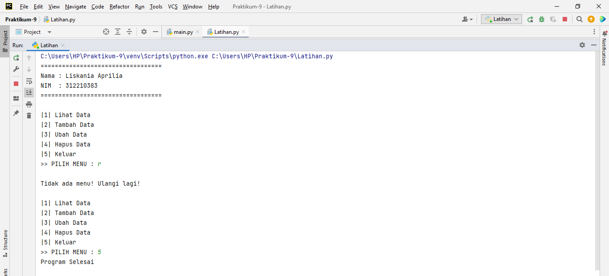
